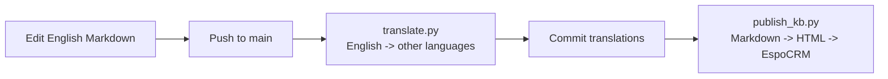

# CFM Shared Knowledge Base

Maintain a multilingual Knowledge Base in [EspoCRM](https://www.espocrm.com/) from
Markdown files, with **English as the single source of truth**.

You write (or edit) articles in English only. From there, everything is automated:
the articles are machine-translated into every other language, then converted to
HTML and published to EspoCRM.

## The intended workflow



1. **Edit English.** Add or change a Markdown file under `articles/English/`.
2. **Push to `main`** (or open a PR to preview).
3. **Watch the magic.** The GitHub Actions pipeline:
   - translates the English articles into every other language folder
     (`Français`, `Español`, `العربية`, …), reusing existing translations so
     established terminology stays consistent;
   - commits the generated translations back to the repo;
   - publishes **all** languages to EspoCRM.

You never edit the translated files by hand — they are regenerated from English.

## Repository layout

```
publish_kb.py         # Converts Markdown -> HTML and publishes to EspoCRM
translate.py          # Translates English articles into the other languages
markdown_utils.py     # Markdown-to-HTML helpers (title extraction, nested lists)
espo_api_client.py    # Minimal EspoCRM API client
pyproject.toml        # Project metadata and dependencies (managed with uv)
uv.lock               # Locked dependency versions
articles/             # Markdown source, one subfolder per language
  English/            #   <- the source of truth; edit these
  Français/           #   <- generated by translate.py
  Español/            #   <- generated by translate.py
  العربية/             #   <- generated by translate.py
.github/workflows/
  publish-kb.yml      # Translate -> commit -> publish pipeline
```

Each language subfolder maps to a Knowledge Base **category** of the same name.
Categories that don't exist yet are created automatically on publish.

## Prerequisites

- [uv](https://docs.astral.sh/uv/) for dependency management.
- An EspoCRM instance with an API key.
- An Azure OpenAI resource with a chat model deployment.

## Setup

Install dependencies into a managed virtual environment:

```powershell
uv sync
```

Create a `.env` file in the project root:

```
# EspoCRM (publishing)
ESPO_URL=https://your-espocrm-instance.example.com
ESPO_API_KEY=your-api-key

# Azure OpenAI (translation)
AZURE_OPENAI_ENDPOINT=https://your-resource.openai.azure.com/
AZURE_OPENAI_API_KEY=your-azure-key
AZURE_OPENAI_DEPLOYMENT=your-deployment-name
```

## Writing articles

Only touch the `English` folder:

1. Add a Markdown file to `articles/English/`, e.g. `roles-and-permissions.md`.
2. The article title is taken from the first `# Heading` in the file, falling
   back to a title-cased version of the file name.

The matching translated files (`articles/Français/roles-and-permissions.md`,
etc.) are produced automatically — don't create them yourself.

## Running locally

Translate English into the other languages, then publish everything:

```powershell
uv run translate.py                           # regenerate all translations
uv run publish_kb.py                          # publish all languages to EspoCRM
```

Preview without making changes:

```powershell
uv run translate.py --dry-run                 # show translation plan, no API calls
uv run publish_kb.py --dry-run                # show publish plan, no writes
uv run translate.py --target-langs Français   # limit to specific languages
```

## Continuous deployment

The [`Translate and Publish Knowledge Base`](.github/workflows/publish-kb.yml)
GitHub Actions workflow runs the full pipeline:

- **On push to `main`** (and via **Actions → Run workflow**): translates English
  into the other languages, commits the results, then publishes to EspoCRM.
- **On pull requests to `main`**: runs a publish **dry-run** only (no translation,
  no writes) so changes can be validated before merging.

Configure these repository secrets for the workflow to run: `ESPO_URL`,
`ESPO_API_KEY`, `AZURE_OPENAI_ENDPOINT`, `AZURE_OPENAI_API_KEY`,
`AZURE_OPENAI_DEPLOYMENT`.
