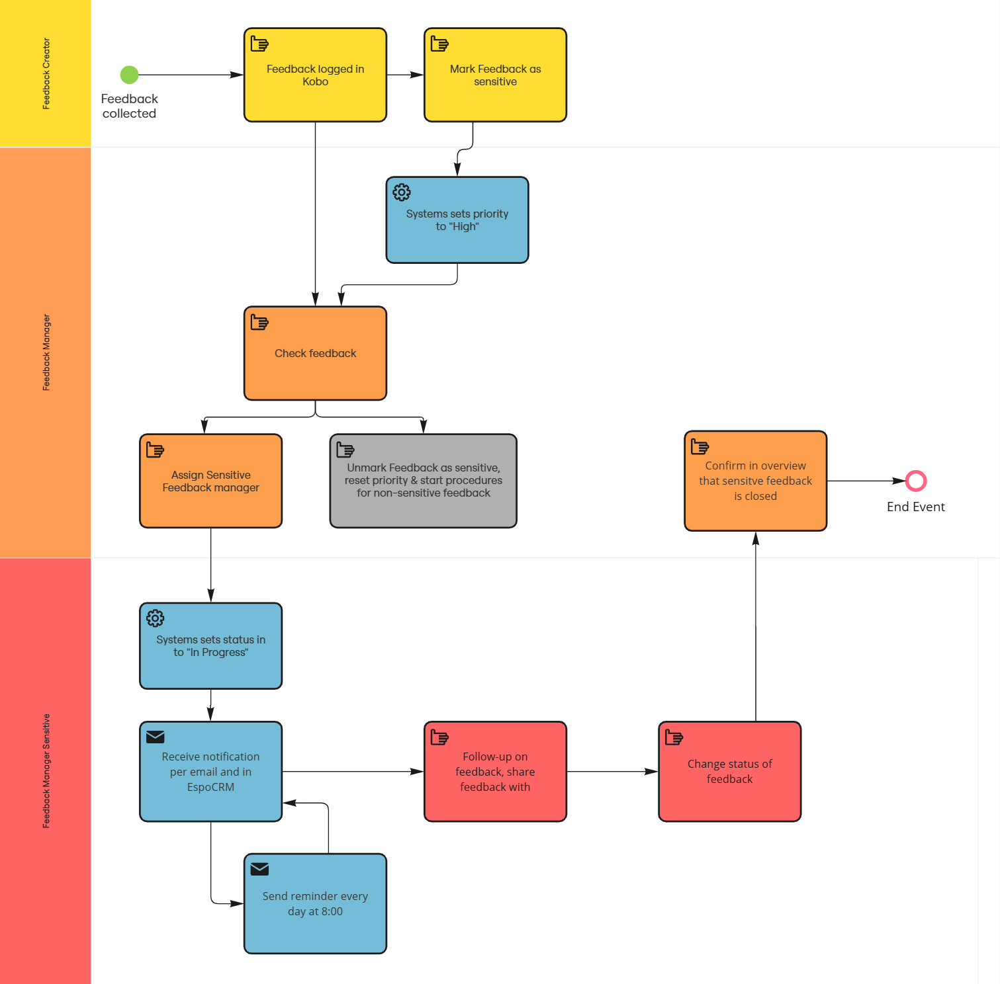

# [TEST] Retroalimentación Sensible
 
### 1. Propósito
 
Para garantizar que la retroalimentación clasificada como sensible por la Sociedad Nacional (SN) se gestione de forma segura, coherente y únicamente por personas autorizadas designadas.
 
### 2. Definición
 
La retroalimentación sensible es una categoría de retroalimentación definida por la Sociedad Nacional (SN), que solo puede ser gestionada por personas responsables específicamente designadas.
 
La retroalimentación sensible puede clasificarse de diferentes maneras, pero aquí hay 2 distinciones principales que se deben tener en cuenta, ya que el seguimiento se realizará de manera diferente:
 
- Incumplimientos del código de conducta (ejemplo: corrupción/fraude/VBG cometidos por personal o voluntariado de la Cruz Roja)
- Retroalimentación que es sensible para la situación personal de alguien (ejemplo: salud, estigma, violencia doméstica).

### 3. Roles y Responsabilidades
 
- **Recolector de Retroalimentación**
  - Registra la retroalimentación en Kobo.
  - Marca la retroalimentación como sensible cuando corresponda.
- **Supervisor de Retroalimentación**
  - Revisa la retroalimentación entrante.
  - Confirma si la retroalimentación es sensible según las definiciones de la SN.
  - Asigna un punto focal de Retroalimentación Sensible designado (ver abajo).
  - Garantiza que se realice el seguimiento.
  - Configuraciones de la cuenta de usuario.
- **Gestor de Retroalimentación**
  - Gestiona el caso de principio a fin.
  - Garantiza el seguimiento y la documentación adecuados.
  - Actualiza el estado y cierra el caso.
  - Configuraciones de la cuenta de usuario.
- **Sistema (Kobo / EspoCRM)**
  - Establece automáticamente la prioridad en *Alta* cuando la retroalimentación se marca como sensible.
  - Autoriza automáticamente a los Gestores de Retroalimentación para gestionar retroalimentación sensible (según los roles/permisos definidos por la SN).
  - Verifica que cualquier persona asignada esté autorizada para gestionar retroalimentación sensible.
  - Establece el estado del caso en *En Progreso* al asignarlo.
  - Envía notificaciones y recordatorios.

### 4. Procedimiento
 
#### Paso 1: Recolección y Registro de Retroalimentación
 
- La retroalimentación se recopila y registra en Kobo.
- Si corresponde, el Recolector de Retroalimentación marca la retroalimentación como **sensible**.
- Si la retroalimentación se marca como sensible, la plataforma automáticamente:
  - Establece su prioridad en **Alta**.
  - La asigna al Supervisor de Retroalimentación para su revisión.

#### Paso 2: Revisión y Validación
 
- El Supervisor de Retroalimentación:
  - Revisa la retroalimentación.
  - Confirma si cumple con la definición de la SN de retroalimentación sensible.
- Si **no es sensible**:
  - Desmarcar como sensible.
  - Restablecer la prioridad.
  - Procesar según los procedimientos estándar de retroalimentación.
- Si **es sensible**:
  - Continuar con el Paso 3.

#### Paso 3: Asignación
 
- El Supervisor de Retroalimentación asigna el caso a un **punto focal de Retroalimentación Sensible** designado.
- El sistema establece el estado del caso en **En Progreso**.

#### Paso 4: Notificación y Monitoreo
 
- El punto focal de Retroalimentación Sensible recibe una notificación por correo electrónico y a través de la Plataforma de Gestión de Retroalimentación.
- El sistema le envía recordatorios diarios hasta que el caso se actualice.

#### Paso 5: Gestión del Caso
 
- El punto focal de Retroalimentación Sensible:
  - Revisa el caso.
  - Toma las medidas apropiadas.
  - Sigue los procedimientos operativos estándar internos para la gestión de casos sensibles.
  - Comparte la retroalimentación internamente **si** es necesario y está permitido.

#### Paso 6: Actualizaciones de Estado
 
- El punto focal de Retroalimentación Sensible actualiza el estado del caso a medida que avanza el trabajo.

#### Paso 7: Cierre
 
- Una vez que el caso se resuelve:
  - El punto focal de Retroalimentación Sensible marca el caso como **cerrado**.
  - El cierre se confirma en el sistema de resumen.

### 5. Principios Clave
 
- La Sociedad Nacional define qué constituye retroalimentación sensible.
- Solo las personas autorizadas pueden gestionar retroalimentación sensible.
- La retroalimentación sensible está oculta para todos los demás usuarios excepto para los usuarios autorizados.
- Todos los casos de retroalimentación sensible se tratan como de **alta prioridad**.
- El seguimiento oportuno es obligatorio y se supervisa activamente.

### 6. Riesgos
 
El incumplimiento de este POE puede dar lugar a:
 
- Retrasos en la gestión de retroalimentación de alto riesgo.
- Incumplimientos de la confidencialidad o de los protocolos de protección.

### 7. Visual del flujo de trabajo
 

 
### 8. Validación
 
- El protocolo debe revisarse antes de finales de 2026 para asegurarse de que siga siendo eficaz.
